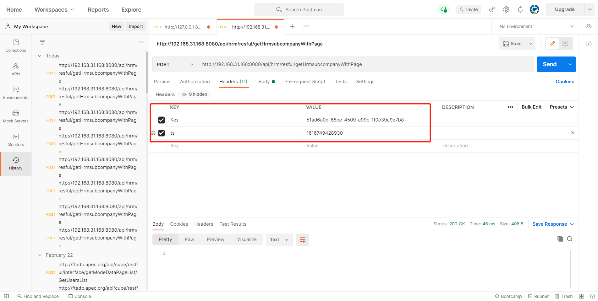
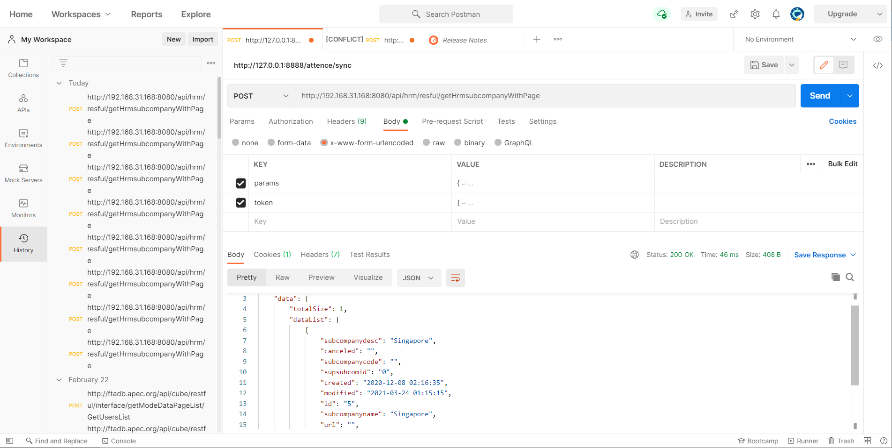

# Users and Organization Structure RESTFUL Interface  #


***Description:*** This document provide the information on how to get users and organizational structures list. RESTFul API document explanations.

## Explanation: 

- The submitted parameters are in the data format of key-value pairs (application/x-www-form-urlencoded), and web browsers will package this data and populate into the http body.
- Authentication Method (**/hrm/websevice/hrm_webservice_config.jsp** will provide authentication methods configurations)
  - IP Address: Allow to configure multiple client IP in /WEB-INF/prop/HrmWebserviceIP.properties, separate by comma. 
  - Token Authentications: Extra parameter in submitted parameters

| Name  | Type   | Mandatory | Description                                                  |
| ----- | ------ | --------- | ------------------------------------------------------------ |
| token | string | Yes       | json string, each token has 5 minutes validity period (the request-side time and the server-side time principle are consistent), suggest to generate new token for every request. |

- Example:

```json5
{
	"key":"92B4BF9322C110E225683F048013B699", //Token+Timestamp milliseconds, then use MD5/SM3 to encrypt to generate as key
	"ts":"1603600893041" // Timestamp milliseconds.
}
```

- key generate methods, java sample: 

```javascript class:"lineNo"
public static void main(String[] args) throws Exception{
	String key = "5936562a-d47c-4a29-9b74-b310e6c971b7" ; //retrieve index method, please browse /hrm/websevice/hrm_webservice_config.jsp
	long l = System.currentTimeMillis() ; // Timestamp milliseconds
	String code = key.concat(Long.toString(l)) ;
	String md5key = Util.getEncrypt(code).toUpperCase() ; //MD5 Encryption and change to UPPERCASE
	Map<String,String> map = new HashMap<>() ;
	map.put("key",md5key) ;
	map.put("ts",Long.toString(l)) ;
	System.out.println(JSONObject.toJSONString(map)); //Token string
}
```

- Sample: There are two methods to configure the token, select either one

  - Token Method 1: Use the header method, insert key, ts parameters.

  

  

  - Token Method 2: Insert the parameters in the body:

  


# Section I: Get Divisions List #


## Request URL

- /api/hrm/resful/getHrmsubcompanyWithPage

## Request Method:

- POST

## Parameters:

|  Name  | Type   | Mandatory | Description      |
| :----: | ------ | --------- | ---------------- |
| params | string | Yes       | json format data |

- Request Parameter - Sample:

| Name           | Type   | Mandatory | Description                                                  |
| -------------- | ------ | --------- | ------------------------------------------------------------ |
| subcompanyname | string |           | Division Name                                                |
| subcompanycode | string |           | Division Code                                                |
| modified       | string |           | modified timestamp; (use >=)                                 |
| canceled       | string |           | Inactive Data indicator; Default will get active data list. 1: Inactive |
| custom_data    | string |           | Specify user-defined field data list, multiple comma to be used to separate fields. Please refer to System Backend-Dashboard - Organization Authorization - User-Defined Item - Division Field Define. <br />eg. : divisiondesc |
| id             | string |           | Division id in OA Database                                   |
| pagesize       | int    |           | Number of records per page, default is 20.                   |
| curpage        | int    |           | Current page, default is 1                                   |


## Example:

```json5
{
	"subcompanyname":"Div001",
	"subcompanycode":"code1",
	"modified":"2020-11-08 00:00:00",
	"created":"2020-11-08 00:00:00",
	"canceled":"",
	"custom_data":"field1,field2",
	"id":"10",
	"pagesize":20,
	"curpage":1
}
```


## Return Sample:

```json5
{
	"code": "1", // 1: Successful, others: Failed
	"data": {
		"totalSize": 1, // Page - Total Page Number
		"dataList": [ // Data Set
			{
				"subcompanydesc": "CAL", // Division Name
				"canceled": "", // Inactive indicator，1: Inactive，Others: Non-inactive
				"subcompanycode": "", // Divison Code
				"supsubcomid": "0", // Parent Division ID, 0 or blank means no parent division
				"created": "2020-01-13 17:59:28", // Creation Timestamp
				"modified": "2020-09-06 00:11:00", // Modified Timestamp
				"id": "11", // Division ID, unique ID
				"subcompanyname": "CAL", // Division Abbreviation
				"url": "", // Abandoned field
				"custom_data" : { // User defined data
                    "divisiondesc": "Manage IT Relevant" // User defined data
                },
				"showorder": "0.0" // Display order
			}
		],
	"pageSize": 20, // Split Page - Records per page
	"page": 1 // Split Page - Current Page No. 
	}
}
```


# Section II: Get Departments List


## Request URL: 

- /api/hrm/resful/getHrmdepartmentWithPage


## Request Method:

- POST


## Parameters:

| Name   | Type   | Mandatory | Description      |
| ------ | ------ | --------- | ---------------- |
| params | string | Yes       | json format data |

- json Parameters Explanation:

| Name           | Type   | Mandatory | Description                                                  |
| -------------- | ------ | --------- | ------------------------------------------------------------ |
| created        | string |           | Created Timestamp; (use >=)                                  |
| modified       | string |           | Modified Timestamp; (use >=)                                 |
| departmentcode | string |           | Department Code                                              |
| departmentname | string |           | Department Name                                              |
| subcompanyid1  | string |           | Division ID                                                  |
| canceled       | string |           | Inactive Indicator; Default query active data, 1: Inactive   |
| id             | string |           | Department ID in OA Database                                 |
| pagesize       | int    |           | Page Size, number of records per page, default: 20           |
| curpage        | int    |           | Current Page, default: 1                                     |
| custom_data    | string |           | Value can be retrieved from the Department user defined field in OA system. Sample : custom_data: 'field1, field2, field3' |

- Sample

```json5
{
	"departmentname":"Technical",
	"departmentcode":"code1",
	"pagesize":20,
	"curpage":1
}
```


## Return Sample: 

```json5
{
	"code": "1", // 1: Succeeded, Others: Failed
	"data": {
	"totalSize": 1, // Total Page Number
	"dataList": [ // Data Set
		{
			"canceled": "", // Inactive Indicator, 1: Inactive, others: Non Inactive
			"supdepid": "0", // Parent Department ID
			"departmentmark": "Technical", // Department Abbreviation
			"departmentname": "Techincal Support", // Department Full Name
			"created": "2019-08-28 10:44:12", // Created Timestamp
			"departmentcode": "", // Department Code
			"modified": "2020-09-07 19:40:09", // Modified Timestamp
			"id": "2", // Department id
			"subcompanyid1": "5", // Division id
			"custom_data": { // User-defined data
				"xlk": "Used" //
			},
			"showorder": "0.0" // 
		}
	],
	"pageSize": 20, // Split Page: Number of records per page
	"page": 1 // Split Page: Current Page Number
	}
}
```


# Section III: Get Positions List


## Request URL: 

- /api/hrm/resful/getJobtitleInfoWithPage


## Request Method:

- POST


## Parameters:

| Name   | Type   | Mandatory | Description      |
| ------ | ------ | --------- | ---------------- |
| params | string | Yes       | json format data |

- json Parameters Explanation:

| Name         | Type   | Mandatory | Description                                        |
| ------------ | ------ | --------- | -------------------------------------------------- |
| created      | string |           | Created Timestamp; (use >=)                        |
| modified     | string |           | Modified Timestamp; (use >=)                       |
| id           | string |           | Position ID in OA Database                         |
| jobtitlename | string |           | Position Name                                      |
| pagesize     | int    |           | Page Size, number of records per page, default: 20 |
| curpage      | int    |           | Current Page, default: 1                           |

- Sample

```json5
{
	"jobtitlename":"Manager",
	"pagesize":20,
	"curpage":1
}
```


## Return Sample: 

```json5
{
	"code": "1", // 1: Succeeded, Others: Failed
	"data": {
	"totalSize": 1, // Split Page - Page Number
	"dataList": [ // Data Set
		{
			"jobdoc": "", // Relevant Doc id
			"jobtitleremark": "", // Remarks
			"jobresponsibility": "", // Job responsibilities
			"jobtitlename": "Default", // Full Name
			"jobcompetency": "", // Job Requirement
			"created": "2019-03-07 13:12:47", // Created Timestamp
			"modified": "2019-03-07 13:12:47", // Modified Timestamp
			"id": "1", // Position ID
			"jobtitlemark": "Default", // Abbreviation
			"jobdepartmentid": "" // Department id (Abandoned Field)
		}
	],
	"pageSize": 20, // Split Page - Number of records per page
	"page": 1 // Split Page - Current Page number
	}
}
```

# Section IV: Get Users List


## Request URL: 

- /api/hrm/resful/getHrmUserInfoWithPage


## Request Method:

- POST


## Parameters:

| Name   | Type   | Mandatory | Description      |
| ------ | ------ | --------- | ---------------- |
| params | string | Yes       | json format data |

- json Parameters Explanation:

| Name               | Type   | Mandatory | Description                                                  |
| ------------------ | ------ | --------- | ------------------------------------------------------------ |
| created            | string |           | Created Timestamp; (use >=)                                  |
| modified           | string |           | Modified Timestamp; (use >=)                                 |
| workcode           | string |           | Employee Code                                                |
| subcompanyid1      | string |           | Division ID                                                  |
| departmentid       | string |           | Department ID                                                |
| jobtitleid         | string |           | Position ID                                                  |
| id                 | string |           | User ID in OA Database, PK                                   |
| loginid            | string |           | User Login ID                                                |
| base_custom_data   | int    |           | To get OA User defined field: [Organization Authorisation] - [User-Defined Settings] - [Staff card fields] - Basic Info. Sample: <br />base_custom_data: 'field1, field2, field3' |
| person_custom_data | string |           | Same as above base_custom_data (Personal Information)        |
| work_custom_data   | string |           | Same as above base_custom_data (Work Information)            |
| pagesize           | int    |           | Records per page, default: 20                                |
| curpage            | int    |           | Current page number, default: 1                              |

- Sample

```json5
{
	"workcode":"S001"
}
```


## Return Sample: 


```json5
{
    "code": "1", //1: Succeeded, Others: Failed
    "data": {
        "totalSize": 1, //Total Records returned
        "dataList": [ //Data list
            {
                "companystartdate": "2020-11-01",//Date Joined
                "tempresidentnumber": "",
                "createdate": "2020-12-08", //Creation Date
                "language": "", //Default User Language
                "workstartdate": "", 
                "subcompanyid1": "5",//Division ID
                "subcompanyname": "Singapore", //Division Name
                "joblevel": "0", //Job level: From 0 - 9
                "startdate": "",
                "password": "xxxx",
                "subcompanycode": "", //Division Code
                "jobactivitydesc": "",//Job Description
                "bememberdate": "",//Only used in China
                "modified": "2021-03-04 21:42:03",//Modified Date
                "id": "30",//User ID in OA Database, Unique ID
                "mobilecall": "",//Other Mobile Number
                "nativeplace": "", //Nationality
                "certificatenum": "", //Certificate Number
                "height": "", //Height
                "loginid": "joseph", //Login ID
                "created": "2020-12-08 02:16:35", //Created Date Time
                "degree": "", //Degree Holder description
                "bepartydate": "", //Only used in China
                "weight": "2147483647", //Weight
                "telephone": "",//Telephone Number
                "residentplace": "",//Resident Place
                "lastname": "Joseph, Low", //Employee Name
                "healthinfo": "0", 
                "enddate": "",
                "maritalstatus": "未婚", //Marital Status
                "departmentname": "CEO Office", //Department Name
                "folk": "",
                "status": "1", //Employee Status: 0: Probabtion, 1: Permanent, 2: Temp Staff, 
                //3:Extended Probation 4: Terminated 5: Resigned 6: Retired 7: Invalid
                "birthday": "", 
                "accounttype": "0", //User Account Type: Null: Main Account 1: Sub-account
                "jobcall": "5", //Job Category
                "managerid": "", //Direct Superior User ID in OA Database
                "assistantid": "", // Assistant User ID in OA Database
                "departmentcode": "", //Department Code
                "belongto": "",
                "email": "kenyu.low@weaver.com.sg", //User Email Address
                "seclevel": "100", //User Security Level
                "policy": "",
                "jobtitle": "3", // Position ID in OA Database
                "workcode": "S001", //Employee ID
                "sex": "男", //Sex
                "departmentid": "8", //Department ID (Departmen Master PK)
                "homeaddress": "",
                "mobile": "",
                "lastmoddate": "2021-03-05", //Last Modified Date
                "educationlevel": "0", 
                "islabouunion": "0", //Only used in China
                "locationid": "3", //Work location ID
                "regresidentplace": "",
                "dsporder": "30.0" //Display Order in OA
            }
        ],
        "pageSize": 20,
        "page": 1
    }
}
```


# Section V: Sync Division

Explanation: During the synchronization, if the data requested does not exist in OA, the record will be created automatically.

## Request URL: 

- /api/hrm/resful/synSubcompany


## Request Method:

- POST


## Parameters:

| Name | Type   | Mandatory | Description                     |
| ---- | ------ | --------- | ------------------------------- |
| data | string |           | Sync Data set, json format data |

- Sample

```json5
[
    {
        "@action":"add", //add: Insert New, edit: Update
        "code":"D001",
        "shortname": "Div001",
        "fullname": "Div001",
        "parentcode":"",
        "canceled": "",
        "order":"9",
        
    }
]
```


## Return Sample: 

```json5
{
    "result": {
        "D001": {
            "msg": "插入成功", //Actions successfully
            "code": "1"
        }
    },
    "code": "1"
}
```


# Section VI: Sync Department

Explanation: During the synchronization, if the data requested does not exist in OA, the record will be created in OA automatically.

## Request URL: 

- /api/hrm/resful/synDepartment


## Request Method:

- POST


## Parameters:

| Name | Type   | Mandatory | Description                     |
| ---- | ------ | --------- | ------------------------------- |
| data | string |           | Sync Data set, json format data |

- Sample

```json5
[
    {
        "@action":"add", //add: Insert New, edit: Update, delete: Update "canceled" field value
        "code":"Dep001", //Department Code
        "shortname": "Dep001", //Department Short Name
        "fullname": "Dep001",//Department Full Name
        "org_code":"D001",//Division Code
        "parent_code":"", //Parent Department Code
        "canceled": "", //This field will be used when @action: delete
        "order":"9", //Display Order in OA
        
    }
]
```


## Return Sample: 

```json5
{
    "result": {
        "Dep001": {
            "msg": "插入成功",
            "code": "1"
        }
    },
    "code": "1"
}
```


# Section VII: Sync Positions

Explanation: During the synchronization, if the data requested does not exist in OA, the record will be created automatically.

## Request URL: 

- /api/hrm/resful/synJobtitle


## Request Method:

- POST


## Parameters:

| Name | Type   | Mandatory | Description                     |
| ---- | ------ | --------- | ------------------------------- |
| data | string |           | Sync Data set, json format data |

- Sample

```json5
[
    {
        "@action":"add", //add: Insert New, edit: Update
        "jobtitlecode":"JOB0001",
        "jobtitlename": "Technician",
        "jobtitleremark": "Technician",
    }
]
```


## Return Sample: 

```json5
{
    "result": {
        "JOB0001": { //Job Code
            "msg": "操作成功", //Action Successful
            "code": "1" //1: Succeeded, Others: Failed
        }
    },
    "code": "1"
}
```


# Section VIII: Sync Users

Explanation: During the synchronization, if the data requested does not exist in OA, the record will be created automatically.

For this interface, validation is against to the **workcode**, if the workcode exists in the OA system, the interface will take it as update function, if the **workcode** does not exist in OA, will insert as a new employee.

## Request URL: 

- /api/hrm/resful/synHrmresource


## Request Method:

- POST


## Parameters:

| Name | Type   | Mandatory | Description                     |
| ---- | ------ | --------- | ------------------------------- |
| data | string |           | Sync Data set, json format data |

- Sample

```json5
[
    {
        "workcode":"S001a",
        "subcompany":"D001", //User's Division, 2 methods: 1) Full division path (HQ>Div>SubDiv), but side effect is the full path exists in OA system, it will update user's Division, else it will insert the division as new division. 2) Use {JSON}{"subcompanycode":"Div001"} as a string for this value, specify division code. (will not create new division)
        "department":"Dep001", //User's Department, 2 methods: 1) Full department path (Dep001>SDep001), side effect: If the full path exists in OA system, it will update user's Department; else it will insert the division as new department. 2) Use {JSON}{"departmentcode":"SDep001"} as a string value, specify department code. (will not create new division)
        "lastname":"Alexandra",//Employee Name
        "loginid":"alex",
        "password":"weaver2020", //Plain text, will be encrypted after
        "seclevel":"80",//Security Level 0-100
        "sex":"Male",//
        "jobtitle":"Technical Engineer", //User's Position, 2 methods: 1) Position Name, side effect: If the position name does not exist in OA, it will insert as new position. 2) Use {JSON}{"jobtitlecode":"fw"} as a string value, specify department code. (will not create new division)
        "jobactivityid":"Executive", //If jobtitle uses JSON can skip this field
        "jobgroupid":"Executive", // Job Type Group ID, if jobtitle uses JSON can skip field
        "jobcall":"2",//Job name, data linked to HrmJobCall Table
        "joblevel":"0", //Job Level Integer Value Only
        "jobactivitydesc":"Description of Job", //Description of Job
        "managerid":"S001", //Important field: Direct Superior, only support user's workcode field
        "assistantid":"",//User's Assistant, only support user's workcode
        "status":"0",//Employee Status: 0: Probabtion, 1: Permanent, 2: Temp Staff, 
                //3:Extended Probation 4: Terminated 5: Resigned 6: Retired 7: Invalid
        "locationid":"", //Work Location
        "workroom":"", //Office room name
        "telephone":"+6512345675", //Telephone number
        "mobile":"+6512345675", //Mobile Number
        "mobilecall":"+6512345675", //Other mobile number
        "fax":"",//Fax number
        "email":"sales@weaver.com.sg", //Important Field, if OA requires email notifications
        "systemlanguage":"English", //User System Language
        "birthday":"2020-01-01", //Birthday, Format: yyyy-MM-dd
		"folk":"", //Ethnic Group
        "nativeplace":"", //Hometown
        "regresidentplace":"", //Used in China Only
        "certificatenum":"", //ID Number, must be unique
        "maritalstatus":"Married",
		"accounttype":"", //主账号：Main Account | 次账号：Sub Account
        "belongto":"",//Main Account, effective only if accounttype:次账号, only support workcode
        "companystartdate":"2021-03-01",  //Date Joined the company, Format: yyyy-MM-dd
        "workstartdate":"2021-03-15", //Date started to work, Format: yyyy-MM-dd
        "base_custom_data":{
            "field01":"test"
        }, //Fields from [Organization Authorisation]-[User-defined Setting]-[Staff Card fields] - [Basic Info] fields
        "person_custom_data":{
            "field01":"test01",
            "field02":"test003"
        },//Fields from [Organization Authorisation]-[User-defined Setting]-[Staff Card fields] - [Personal Information] fields
        "work_custom_data":{
            "field03":""
        },//Fields from [Organization Authorisation]-[User-defined Setting]-[Staff Card fields] - [Working Experience] fields
    }
]
```


## Return Sample: 

```json5
{
    "result": {
        "S001b": {
            "msg": "S001b|Jason|创建|成功|", 
            "code": "1" //1: Succeeded, Others: Failed
        }
    },
    "code": "1"
}
```


